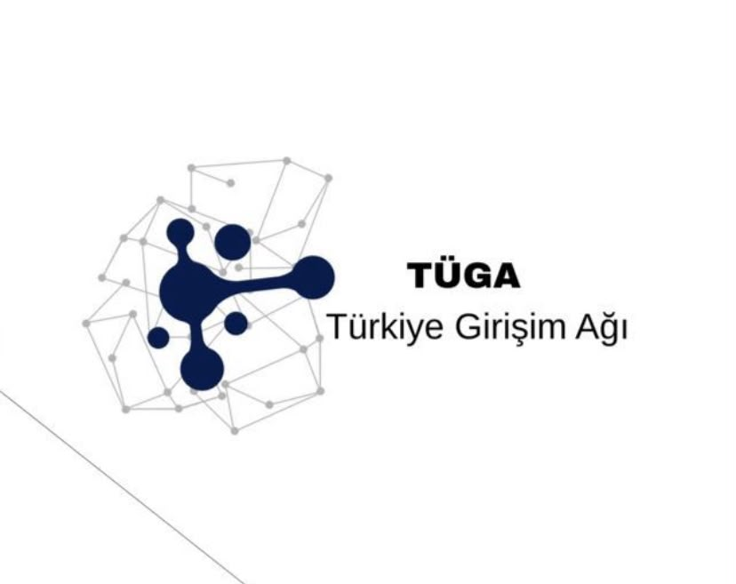

<div align="center">



# TÜGA CTF Laboratuvarları

**Senaryolu, Docker ile lokalde tek komutta ayağa kalkan Türkçe siber güvenlik lab'ları — her biri en az 2 farklı zafiyet ve 2 flag içerir.**

[](#-katalog)
[](#-katalog)
[](https://github.com/fevziegeyurtsevenler/tuga-ctf-laboratuvarlari/actions/workflows/lab-dogrula.yml)
[](CONTRIBUTING.md)
[](https://github.com/fevziegeyurtsevenler/tuga-ctf-laboratuvarlari/graphs/contributors)
[](LICENSE.md)

🌐 **[Katalog sitesini aç →](https://fevziegeyurtsevenler.github.io/tuga-ctf-laboratuvarlari/)** &nbsp;·&nbsp; 🚩 **[Kendi lab'ını ekle →](CONTRIBUTING.md)**

*TÜGA Siber Güvenlik Komitesi'nin 2. ortak projesi. Her lab en az 2 farklı zafiyet + 2 flag içerir, PR ile katkıya açıktır.*

</div>

---

## Bu nedir?

Uygulamalı, **senaryolu** mini CTF laboratuvarları toplayan bir monorepo. Her lab
kendi klasöründe (`labs/<slug>/`) yaşar, **Docker ile lokalde** çalışır ve içinde
kasıtlı olarak **en az 2 farklı zafiyet** ile **en az 2 flag** barındırır.

- **Çözmek için:** bir lab seç, tek komutla ayağa kaldır, zafiyetleri sömür, flag'ini
  [katalog sitesindeki](https://fevziegeyurtsevenler.github.io/tuga-ctf-laboratuvarlari/)
  doğrulama kutusuna gir. Flag'ler sitede asla gösterilmez; yalnızca `sha256` hash'i tutulur.
- **Lab eklemek için:** bir alan seç (Web, Ağ, OSINT, Binary, AI Güvenliği…), hayal
  gücüne dayalı bir senaryo kur, Docker'la paketle, PR at. Ayrıntı: [CONTRIBUTING.md](CONTRIBUTING.md).

## Bir lab'ı çalıştır

```bash
# İstediğin labın klasörüne gir, tek komut:
cd labs/sablon-lab
docker compose up -d --build
# → tarayıcıda http://localhost:8080
docker compose down -v   # kapatmak için
```

> Sitedeki her kartta o labı **sparse-checkout** ile tek başına indirip çalıştıran
> hazır komut var; "▶ Kurulum komutu" düğmesiyle kopyalarsın.

## 🚩 Katalog

<!-- Bu tablo scripts/site_uret.py tarafından otomatik üretilir; ELLE düzenleme. -->
<!-- LAB-KATALOG:BASLA -->
| Lab | Alan | Zorluk | Zafiyet | Flag | Yazar |
|-----|------|--------|---------|------|-------|
| [TÜGA İç Portalı](labs/sablon-lab/) | 🕸️ Web | Kolay | 2 | 2 | [@fevziegeyurtsevenler](https://github.com/fevziegeyurtsevenler) |
| [Night Hatch — Redhollow 1994](labs/redhollow-1994/) | 🔬 Adli Bilişim | Orta | 4 | 12 | [@rplny](https://github.com/rplny) |
| [Son Vardiya](labs/son-vardiya/) | 🕸️ Web | Orta | 2 | 2 | [@YusufB-8](https://github.com/YusufB-8) |
<!-- LAB-KATALOG:BITIS -->

## Repo düzeni

```
labs/<slug>/          her lab bir klasör
  ├── lab.yml         meta (başlık, alan, zorluk, senaryo, zafiyetler, flag hash'leri)  ← tek doğruluk kaynağı
  ├── docker-compose.yml
  ├── Dockerfile + kaynak kod
  ├── README.md       senaryo + kurulum
  └── COZUM.md        (opsiyonel) çözüm anahtarı — spoiler
scripts/site_uret.py  lab.yml'lerden siteyi + bu README katalogunu üretir
scripts/lab_dogrula.py PR'da sözleşmeyi denetler
docs/                 GitHub Pages sitesi (otomatik üretilir)
```

## Katkı & lisans

Katkı akışı ve lab yazma sözleşmesi: **[CONTRIBUTING.md](CONTRIBUTING.md)**.
İçerik [CC BY 4.0](LICENSE.md). Lab'lar **kasıtlı zafiyetlidir**; yalnızca lokalde /
izinli ortamda çalıştır — bkz. [SECURITY.md](SECURITY.md).
